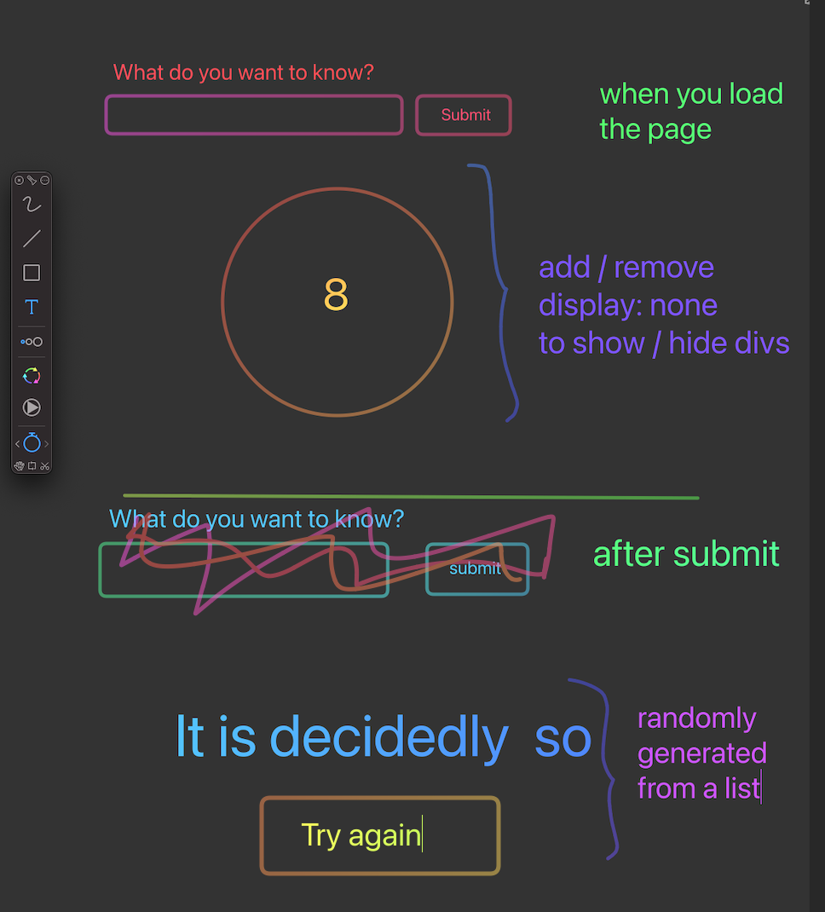

# Fortune Teller Plan

## HTML Elements

-   text input for the question
-   button - trigger the fortune -- add an event listener
-   image for the 8 ball (wrapped in a div)
-   p or a div for the fortune - display the chosen fortune -- set the text content

## State Variables (data that changes over time)

-   selectedFortune

## Events

-   submit button click

    -   pick a random fortune
    -   remove the 8 ball image & inputs
    -   display the fortune div
    -   display a try again button

-   play again button click
    -   display the 8 ball and the inputs
    -   remove the fortune div
